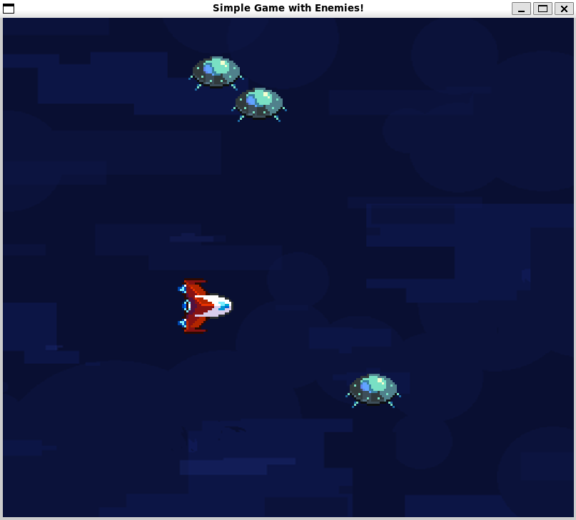

  

A simple <b>Pygame</b> tutorial for beginners. This tutorial covers:
- Player movement
- Collision

Check out the [documented tutorial](./mandatory-doc.md) here.  
<i>*currently working on score system</i>

### Contributors
- Art & Design: [Sheldon-Chong](https://github.com/Sheldon-Chong)
